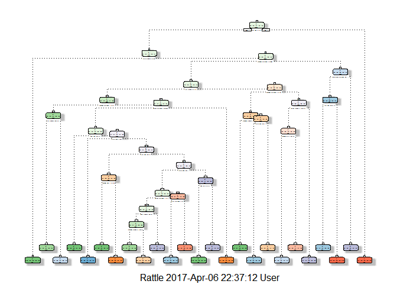
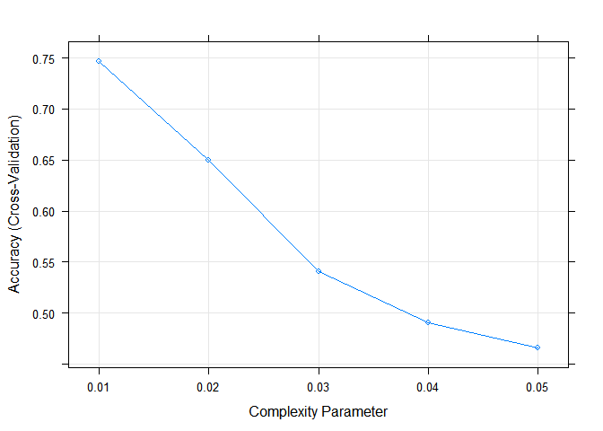
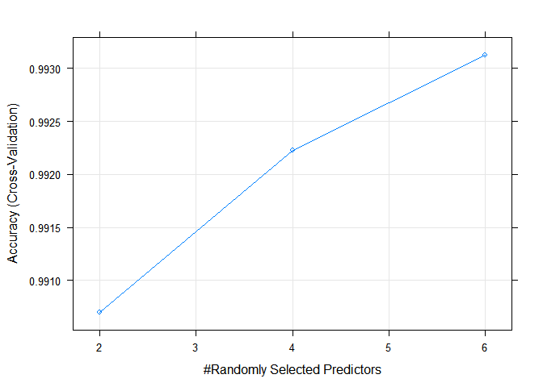
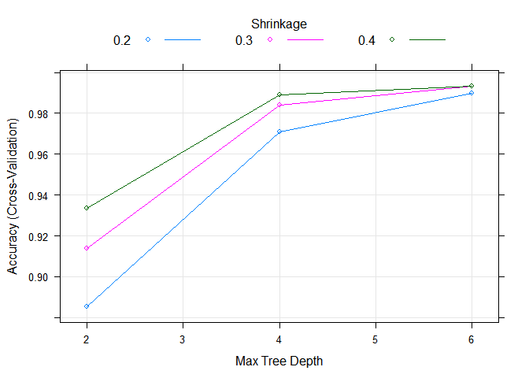

Data Preprocessing
------------------

### 1. Load Data

Download the training and testing data and read them as `training` and
`testing`. The `testing` data should be left untouched till the
prediction stage.

    if(!file.exists("training.csv")) {
    fileURL <- "https://d396qusza40orc.cloudfront.net/predmachlearn/pml-training.csv"
    download.file(fileURL, "training.csv")
    }
    if(!file.exists("testing.csv")) {
    fileURL <- "https://d396qusza40orc.cloudfront.net/predmachlearn/pml-testing.csv"
    download.file(fileURL, "testing.csv")
    }
    training <- read.csv("training.csv", stringsAsFactors = FALSE, na.strings = c("", "NA"))
    testing <- read.csv("testing.csv", stringsAsFactors = FALSE, na.strings = c("", "NA"))

### 2. Explore structure of the data

We will focus on the training data as that will be the data which we use
to build our models.

    dim(training)

    ## [1] 19622   160

    str(training[, 10:20])

    ## 'data.frame':    19622 obs. of  11 variables:
    ##  $ yaw_belt            : num  -94.4 -94.4 -94.4 -94.4 -94.4 -94.4 -94.4 -94.4 -94.4 -94.4 ...
    ##  $ total_accel_belt    : int  3 3 3 3 3 3 3 3 3 3 ...
    ##  $ kurtosis_roll_belt  : chr  NA NA NA NA ...
    ##  $ kurtosis_picth_belt : chr  NA NA NA NA ...
    ##  $ kurtosis_yaw_belt   : chr  NA NA NA NA ...
    ##  $ skewness_roll_belt  : chr  NA NA NA NA ...
    ##  $ skewness_roll_belt.1: chr  NA NA NA NA ...
    ##  $ skewness_yaw_belt   : chr  NA NA NA NA ...
    ##  $ max_roll_belt       : num  NA NA NA NA NA NA NA NA NA NA ...
    ##  $ max_picth_belt      : int  NA NA NA NA NA NA NA NA NA NA ...
    ##  $ max_yaw_belt        : chr  NA NA NA NA ...

As we can see above, certain variables have very high proportion of
missing values and these variables will not be very useful for us to
build reliable models.

### 3. Missing values

We set the threshold for missing values at 95%, which means that for any
variables with more than 95% missing values, we simply remove these
variables.

    prop.missing <- apply(training, 2, function(x) sum(is.na(x)) / nrow(training))
    training <- training[, prop.missing < 0.95]
    dim(training)

    ## [1] 19622    60

From 160 variables, we are left with 60 variables.

### 4. Remove "for reference only" variables

Some variables are only for reference (columns 1 to 7), which can be
removed as it is not useful for us to build our model.

    str(training[, 1:10])

    ## 'data.frame':    19622 obs. of  10 variables:
    ##  $ X                   : int  1 2 3 4 5 6 7 8 9 10 ...
    ##  $ user_name           : chr  "carlitos" "carlitos" "carlitos" "carlitos" ...
    ##  $ raw_timestamp_part_1: int  1323084231 1323084231 1323084231 1323084232 1323084232 1323084232 1323084232 1323084232 1323084232 1323084232 ...
    ##  $ raw_timestamp_part_2: int  788290 808298 820366 120339 196328 304277 368296 440390 484323 484434 ...
    ##  $ cvtd_timestamp      : chr  "05/12/2011 11:23" "05/12/2011 11:23" "05/12/2011 11:23" "05/12/2011 11:23" ...
    ##  $ new_window          : chr  "no" "no" "no" "no" ...
    ##  $ num_window          : int  11 11 11 12 12 12 12 12 12 12 ...
    ##  $ roll_belt           : num  1.41 1.41 1.42 1.48 1.48 1.45 1.42 1.42 1.43 1.45 ...
    ##  $ pitch_belt          : num  8.07 8.07 8.07 8.05 8.07 8.06 8.09 8.13 8.16 8.17 ...
    ##  $ yaw_belt            : num  -94.4 -94.4 -94.4 -94.4 -94.4 -94.4 -94.4 -94.4 -94.4 -94.4 ...

    training <- training[,-c(1:7)]

From 60 variables, we are left with 53 variables.

### 5. Check for variables with near zero variance.

Let's also check for any variables which have variance close to zero,
which would also not be useful in explaining the dependent variable.

    library(caret)
    nearZeroVar(training)

    ## integer(0)

There are no variables with close to zero variance, so we will stick
with 53 variables.

### 6. Data splitting

To prevent overfitting, we split the data into 80:20, 80% in a training
set and 20% in a hold-out validation set. The training set will be used
to build our models later while the hold-out validation set will be used
to test our model accuracy before applying prediction on the testing
data. We also first set the seed for reproducibility purpose.

    set.seed(1234)
    inTrain <- createDataPartition(training$classe, p = 0.8, list = FALSE)
    trainSet <- training[inTrain,]
    validSet <- training[-inTrain,]

Building the Models
-------------------

We start by setting up the training control parameters. In particular,
we are setting up a 5-fold cross validation for all the models that we
are going to build.

    myControl <- trainControl(method = "cv", number = 5, verboseIter = FALSE)

### 1. Classification Tree Model

We set up the grid for the complexity parameter `cp` which takes values
from 0.01 to 0.05. Then we fit the model for these cp values. We then
choose the model with the highest out-of-bag accuracy from our 5-fold
cross validation and plot the classification tree.

    library(rpart)
    library(rattle)
    library(rpart.plot)
    library(RColorBrewer)
    treeGrid <- expand.grid(cp = seq(0.01, 0.05, 0.01))
    tree.mod <- train(classe~., data = trainSet, trControl = myControl, tuneGrid = treeGrid, method = "rpart")
    tree.mod$results

    ##     cp  Accuracy     Kappa  AccuracySD     KappaSD
    ## 1 0.01 0.7462235 0.6780931 0.014253245 0.018174092
    ## 2 0.02 0.6497253 0.5596692 0.016583727 0.020381586
    ## 3 0.03 0.5404782 0.4014069 0.009640688 0.012803886
    ## 4 0.04 0.4901575 0.3342379 0.006260505 0.007733291
    ## 5 0.05 0.4662798 0.2933677 0.057281226 0.095641338

    fancyRpartPlot(tree.mod$finalModel)

    plot(tree.mod)

As can be seen, the tree is rather complex at a `cp` - compexity
parameter value of 0.01, the accuracy also decreases substantially if we
fit a less complex model as we go from lower 'cp' to higher 'cp' values.
Even at a \`cp' value of 0.01, the out-of-bag accuracy is only
0.7462235. Let's explore in the next section to see if we can find
better models.

### 2. Random Forest Model

We explore the Random Forest Model where we first set up the grid for
the mtry parameter `mtry` which takes values 2, 4 and 6. `mtry` is the
number of randomly sampled variables that we want to consider while
splitting the nodes. Then we build 50 trees in each model for these
different `mtry` values. We then choose the model with the highest
out-of-bag accuracy from the 5-fold cross validation and examine the
results.

    library(ranger)
    library(e1071)
    rfGrid <- expand.grid(mtry = c(2, 4, 6))
    rf.mod <- train(classe~., data = trainSet, trControl = myControl, tuneGrid = rfGrid, num.trees = 50, method = "ranger")
    rf.mod$results

    ##   mtry  Accuracy     Kappa  AccuracySD     KappaSD
    ## 1    2 0.9907008 0.9882347 0.002064732 0.002613219
    ## 2    4 0.9922294 0.9901695 0.002723943 0.003446408
    ## 3    6 0.9931210 0.9912974 0.001750624 0.002214935

    plot(rf.mod)

As seen above, the out-of-bag accuracy of the random forest model is
very high even if we just consider 2 randomly selected variables at each
split. Nevertheless, we just pick the model with the highest accuracy at
0.9931210 with `mtry` value of 6.

### 3. Extreme Gradient Boosting Model

We try another popular model - xgboost. We set up the grid search with
several different `eta` and `max_depth` values. `nrounds` is set to 50,
`gamma` is set to 0.5, while other hyperparameters are set to the
default values. `eta` is the learning rate parameter, `max_depth` is the
maximum depth of a tree, `nround` is the maximum number of iterations
for each model with their set of parameters. We fit the model for all
possible set of hyperparameters already defined and we pick the model
with the highest out-of-bag accuracy from the 5-fold cross validation.

    library(xgboost)
    xgbGrid <- expand.grid(eta = c(0.2, 0.3, 0.4), max_depth = c(2, 4, 6), gamma = 0.5, nrounds = 50, colsample_bytree = 1, min_child_weight = 1, subsample = 1)
    xgb.mod <- train(classe~., data = trainSet, trControl = myControl, tuneGrid = xgbGrid, method = "xgbTree")
    xgb.mod

    ## eXtreme Gradient Boosting 
    ## 
    ## 15699 samples
    ##    52 predictor
    ##     5 classes: 'A', 'B', 'C', 'D', 'E' 
    ## 
    ## No pre-processing
    ## Resampling: Cross-Validated (5 fold) 
    ## Summary of sample sizes: 12558, 12561, 12558, 12559, 12560 
    ## Resampling results across tuning parameters:
    ## 
    ##   eta  max_depth  Accuracy   Kappa    
    ##   0.2  2          0.8852160  0.8546924
    ##   0.2  4          0.9707613  0.9630131
    ##   0.2  6          0.9898717  0.9871889
    ##   0.3  2          0.9138158  0.8909681
    ##   0.3  4          0.9840748  0.9798558
    ##   0.3  6          0.9931842  0.9913789
    ##   0.4  2          0.9334979  0.9158705
    ##   0.4  4          0.9891711  0.9863023
    ##   0.4  6          0.9934390  0.9917012
    ## 
    ## Tuning parameter 'nrounds' was held constant at a value of 50
    ##  1
    ## Tuning parameter 'min_child_weight' was held constant at a value of
    ##  1
    ## Tuning parameter 'subsample' was held constant at a value of 1
    ## Accuracy was used to select the optimal model using  the largest value.
    ## The final values used for the model were nrounds = 50, max_depth = 6,
    ##  eta = 0.4, gamma = 0.5, colsample_bytree = 1, min_child_weight = 1
    ##  and subsample = 1.

    plot(xgb.mod)

As seen above, the out-of-bag accuracy of the Extreme Gradient Boosting
model is also very high at different levels of learning rate and
(shrinkage) and max tree depth. In this case, we also pick the model
with the highest accuracy of 0.9934390 with a learning rate `eta` of 0.4
and a max tree depth of 6.

Out-of-sample Test
------------------

Now we test our model on the hold-out validation set. We use the random
forest model and the extreme gradient boosting model with their final
tuned parameters.

### 1. Random Forest Model

    rf.pred <- predict(rf.mod, validSet)
    rf.cm <- confusionMatrix(rf.pred, validSet$classe)
    rf.cm$table

    ##           Reference
    ## Prediction    A    B    C    D    E
    ##          A 1115    2    0    0    0
    ##          B    1  756    6    0    0
    ##          C    0    1  678    6    0
    ##          D    0    0    0  637    0
    ##          E    0    0    0    0  721

    rf.cm$overall[1]

    ##  Accuracy 
    ## 0.9959215

### 2. Extreme Gradient Boosting Model

    xgb.pred <- predict(xgb.mod, validSet)
    xgb.cm <- confusionMatrix(xgb.pred, validSet$classe)
    xgb.cm$table

    ##           Reference
    ## Prediction    A    B    C    D    E
    ##          A 1114    1    0    0    0
    ##          B    1  756    4    0    0
    ##          C    0    2  680    2    0
    ##          D    0    0    0  641    0
    ##          E    1    0    0    0  721

    xgb.cm$overall[1]

    ## Accuracy 
    ## 0.997196

Both models were highly accurate with an out-of-sample error of around
0.4% for random forest and 0.3% for extreme gradient boosting, but the
extreme gradient boosting model appears to be slightly more consistent
in predicting across different classes as seen in the confusion matrix.
So the extreme gradient boosting model is chosen to predict the testing
set.
